<!-- Hero banner: switches with the viewer's GitHub theme. Regenerate with `python3 scripts/build_banner.py`. -->
<picture>
  <source media="(prefers-color-scheme: dark)" srcset="./dark.svg">
  <source media="(prefers-color-scheme: light)" srcset="./light.svg">
  
</picture>

<p align="center">
  <a href="mailto:ameyakabir@gmail.com"></a>
  
  
  
</p>

<br>

## `> about`

```yaml
name:      Ameya Ajit Kabir
role:      Automation Developer · RPA Engineer
based:     Pune, India
building:  tools that run unattended — and tell you when something breaks
```

I build **automation that holds up in production**: enterprise web automation, API integrations and the database layers underneath them.

- **Enterprise IT alerting** — watchdog services with multi-level escalation, so incidents reach the right person before users notice.
- **Healthcare workflows** — RPA pipelines that move data between portals, APIs and databases without manual re-entry.
- **Developer tooling** — custom Chrome extensions for DOM inspection that make selector-hunting for web bots fast and repeatable.
- **Data architecture** — PostgreSQL schemas designed for auditability, reporting and the edge cases automation always finds.

<br>

<p align="center">
  <picture>
    <source media="(prefers-color-scheme: dark)" srcset="./data_sentinel.svg">
    <source media="(prefers-color-scheme: light)" srcset="./data_sentinel-light.svg">
    
  </picture>
</p>

<br>

## `> stack`

<div align="center">

| | |
|:--|:--|
| **Languages** |       |
| **Automation** |     |
| **Data** |     |
| **Web & Tooling** |      |

</div>

<br>

## `> featured builds`

<sub><code>5 builds</code> &nbsp;·&nbsp; tap a row to expand</sub>

<details open>
<summary><b>🟢 <code>DEPLOYED</code>&nbsp; Epic Healthcare Referral Bots</b>&nbsp; <sub><code>ENTERPRISE</code></sub></summary>
<br>

> **▸ What it does**<br>
> Automated referral <b>intake, response and monitoring</b> bots for Epic, deployed across major healthcare clients — <b>Yale</b>, <b>UNC</b> and <b>Hartford</b>.

> **⚙ Under the hood**<br>
> `Headless browser automation` · `DOM state polling` · `Database update queries`

<p>
  &nbsp;&nbsp;
</p>

</details>

<details>
<summary><b>🟢 <code>LIVE</code>&nbsp; Enterprise IT Alerting System</b>&nbsp; <sub><code>ENTERPRISE</code></sub></summary>
<br>

> **▸ What it does**<br>
> Always-on watchdog that monitors services, raises incidents on failure, and walks them up a <b>multi-level escalation chain</b> via email and <b>Voximplant</b> phone calls.

> **⚙ Under the hood**<br>
> `Watchdog loop` · `Escalation tiers with timeouts` · `State persistence`

<p>
  &nbsp;&nbsp;
</p>

</details>

<details>
<summary><b>🚀 <code>LIVE</code>&nbsp; Finstash</b>&nbsp; <sub><code>FULL-STACK</code></sub></summary>
<br>
<a href="https://finstash.net"></a>
&nbsp;<b><a href="https://finstash.net">finstash.net</a></b>


> **▸ What it does**<br>
> Full-stack personal finance and expense tracking web app, with custom <b>carpool tracking</b> and <b>investment portfolio</b> modules.

> **⚙ Under the hood**<br>
> `Normalised PostgreSQL schema` · `REST API` · `Aggregate queries powering the dashboard`

<p>
  &nbsp;&nbsp;
</p>

</details>

<details>
<summary><b>🛠️ <code>ACTIVE</code>&nbsp; Dynamic XPath DOM Inspector</b>&nbsp; <sub><code>TOOLING</code></sub></summary>
<br>

> **▸ What it does**<br>
> Custom Chrome extension that generates <b>resilient, dynamic XPaths</b> and inspects DOM elements on the fly.

> **⚙ Under the hood**<br>
> `Background service workers` · `DOM mutation observers` · `Injected UI overlay`

<p>
  &nbsp;&nbsp;
</p>

</details>

<details>
<summary><b>🎮 <code>ACTIVE</code>&nbsp; The Tower Game Automation</b>&nbsp; <sub><code>PERSONAL</code></sub></summary>
<br>

> **▸ What it does**<br>
> Complete automation tool for the mobile game <i>The Tower</i> running in BlueStacks — reads game state and drives repetitive farming hands-free.

> **⚙ Under the hood**<br>
> `ADB control logic` · `Screen-state detection` · `Transparent Tkinter HUD overlay` · `Telemetry logging`

<p>
  &nbsp;&nbsp;
</p>

</details>

<br>

<p align="center">
  <sub><code>$ echo "if it's repetitive, it's a bug"</code> &nbsp;·&nbsp; open to automation, integration &amp; data-heavy problems</sub>
</p>
