<!-- Hero banner: switches with the viewer's GitHub theme. Regenerate with `python3 scripts/build_banner.py`. -->
<picture>
  <source media="(prefers-color-scheme: dark)" srcset="./dark.svg">
  <source media="(prefers-color-scheme: light)" srcset="./light.svg">
  
</picture>

<p align="center">
  <a href="mailto:ameyakabir@gmail.com"></a>
  
  
  
</p>

<br>

## `> about`

```yaml
name:      Ameya Ajit Kabir
role:      Automation Developer · RPA Engineer
based:     Pune, India
building:  tools that run unattended — and tell you when something breaks
```

I build **automation that holds up in production**: enterprise web automation, API integrations and the database layers underneath them.

- **Enterprise IT alerting** — watchdog services with multi-level escalation, so incidents reach the right person before users notice.
- **Healthcare workflows** — RPA pipelines that move data between portals, APIs and databases without manual re-entry.
- **Developer tooling** — custom Chrome extensions for DOM inspection that make selector-hunting for web bots fast and repeatable.
- **Data architecture** — PostgreSQL schemas designed for auditability, reporting and the edge cases automation always finds.

<br>

## `> stack`

<div align="center">

| | |
|:--|:--|
| **Languages** |       |
| **Automation** |     |
| **Data** |     |
| **Web & Tooling** |      |

</div>

<br>

## `> featured builds`

| Project | What it does | Under the hood | Stack |
|:--|:--|:--|:--|
| 🛰️ **Enterprise IT Alerting System** | Always-on watchdog that monitors services and scheduled jobs, raises incidents the moment something fails, and walks them up a **multi-level escalation chain** until someone acknowledges. | Watchdog loop · escalation tiers with timeouts · incident state persisted for audit & reporting | `Java` `Python` `PostgreSQL` `AutomationEdge` |
| 🗼 **The Tower — BlueStacks HUD Overlay** | Automation overlay for *The Tower* running in BlueStacks: a heads-up display layered over the emulator that reads game state and drives repetitive actions hands-free. | Transparent always-on-top HUD · screen-state detection · scripted input to the emulator | `Python` `BlueStacks` |
| 💸 **Personal Expense Tracker** | Full-stack tracker for logging spending, categorising transactions and seeing where the money actually goes month over month. | Normalised PostgreSQL schema · REST API · aggregate queries powering the dashboard | `PostgreSQL` `Node.js` `Express` `JavaScript` |

<br>

## `> stats`

<div align="center">

<picture>
  <source media="(prefers-color-scheme: dark)" srcset="https://github-readme-stats.vercel.app/api?username=ameya-kabir&show_icons=true&include_all_commits=true&count_private=true&hide_border=false&border_radius=16&bg_color=0F172A&border_color=1E293B&title_color=22D3EE&icon_color=7C3AED&text_color=CBD5E1&ring_color=10B981">
  
</picture>
<picture>
  <source media="(prefers-color-scheme: dark)" srcset="https://github-readme-stats.vercel.app/api/top-langs/?username=ameya-kabir&layout=compact&langs_count=8&hide_border=false&border_radius=16&bg_color=0F172A&border_color=1E293B&title_color=22D3EE&text_color=CBD5E1">
  
</picture>

<picture>
  <source media="(prefers-color-scheme: dark)" srcset="https://streak-stats.demolab.com?user=ameya-kabir&background=0F172A&border=1E293B&border_radius=16&stroke=1E293B&ring=7C3AED&fire=22D3EE&currStreakNum=E2E8F0&sideNums=E2E8F0&currStreakLabel=22D3EE&sideLabels=94A3B8&dates=64748B">
  
</picture>

<picture>
  <source media="(prefers-color-scheme: dark)" srcset="https://github-readme-activity-graph.vercel.app/graph?username=ameya-kabir&bg_color=0F172A&color=94A3B8&title_color=22D3EE&line=22D3EE&point=7C3AED&area=true&area_color=7C3AED&hide_border=false&border_color=1E293B&radius=16&custom_title=Commit%20activity">
  
</picture>

</div>

<br>

<p align="center">
  <sub><code>$ echo "if it's repetitive, it's a bug"</code> &nbsp;·&nbsp; open to automation, integration &amp; data-heavy problems</sub>
</p>
